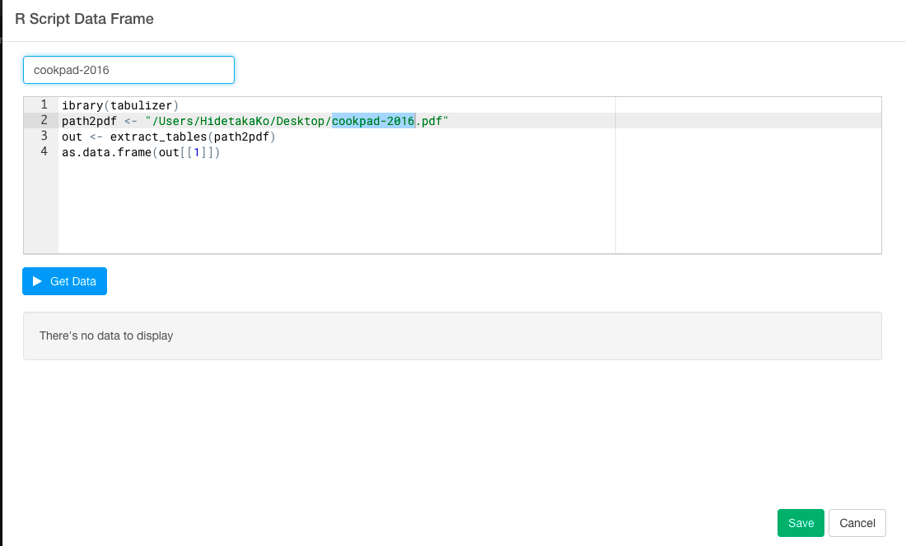
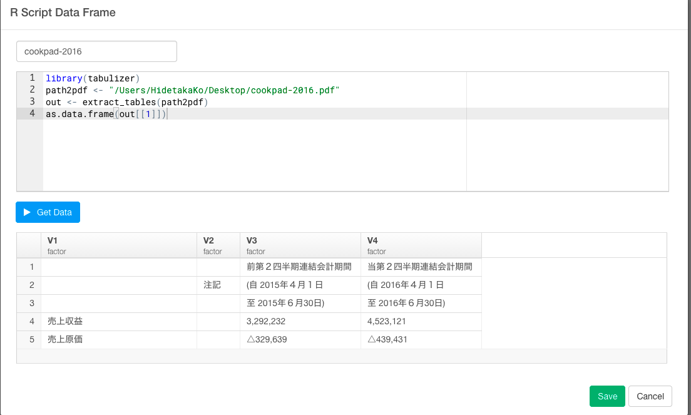

#「2016年版このRパッケージがすごい」暫定第一位、tabulizerパッケージを使って、日本で話題のCookpadの有価証券PDFから超簡単にデータを取得してビジュアライズまでしてみた


今年の3月ごろから何やらCookpadが騒がしいですね。IT業界に足を置いていれば、このような噂を聞いたりするのは、1度や2度ではないのではないのでしょうか？一部報道には、幹部社員が大量離脱したためサービス運営が困難、という報道もありました。Cookpadの有価証券から、実際に決算がどうなっているのかを見てみると、噂が本当なのかや事件の影響について検証できそうです。事件の前と後で業績に変化はあったのか、1株あたりの利益はどれくらい増加しているのかって質問に答えることができそうです。ところが、ほとんどの有価証券はPDFデータになっています。PDFデータに埋まっていると、そのデータをまずcsvにエクスポートすることや、その後取ってきたデータを加工して分析やビジュアライズできるようにするという過程が、結構めんどくさかったりしますよね。だから、今日は、Exploraotryを使って、そんなPDFデータの分析の方法について、簡単に見ていきたいと思います。

- 1.Cookpadの有価証券のPDF表データを保存する
- 2.tabulizerパッケージを使って、PDF表データをインポートする
- 3.データを整形する
- 4.2015年の第二四半期の有価証券のデータをジョインする
- 5.有価証券のデータをビジュアライズする


##1.Cookpadの有価証券のPDF表データを保存する

まず、Cookpadの有価証券のPDF表データをデスクトップに保存しましょう。PDFデータは、Cookpadのホームページに行くと取得することができます。


このページだけを保存したいので、ページ数を指定します。


ファイル名を指定して、デスクトップに保存します。


##2.tabulizerパッケージを使って、PDF表データをインポートする

まず、PDFデータをインポートするには、Rのtabulizerパッケージというのをインストールする必要があります。Rstudioからtabulizerパッケージをインストールしましょう。Rstudioを持っていない方は、[こちら](https://www.rstudio.com/)からRstudioをダウンロードしてください。

```
install.packages("devtools")
library(githubinstall)
githubinstall(c("tabulizerjars", "tabulizer"))
```


2を選んでください。これでインストール完了です。

次に、Exploratoryだと、Import by Writing R scriptという機能を使えば、複雑で汚いウェブ・ページからデータを思い通りにスクレイピングしてくることができたり、RstudioでインストールしたRのパッケージを読み込むことができたり、さらにはその後のデータの加工もデータ分析しながら簡単に出来るということなので、早速やってみました。

Import by Writing R scriptをクリックします。


ここで、先ほどインストールしたtabulizerパッケージを使って、CookpadのPDFデータを取得するスクリプトを書いていきます。

```
library(tabulizer)
path2pdf <- "/Users/HidetakaKo/Desktop/cookpad-2016.pdf"
out <- extract_tables(path2pdf)
as.data.frame(out[[1]])
```


Get Dataボタンを押します。



このステップだけで、PDFデータを取得することができました。スクリプトにあるcookpad-2016.pdfを自分が取得したいPDFデータのファイル名に変えるだけで同じように取得することができます。

テーブルViewに行って、実際のデータとくらべてみましょう。


こちらが実物です。


##3.2015年の第二四半期の有価証券のデータをジョインする

騒動があった2016年以降のデータだけを見てもおもしろくないので、事件以前と事件後でCookpadに業績に影響があったのかを分析するために、2015年以前の第二四半期の有価証券のデータも取得して、ジョインをして比べたいと思います。

まず、また同じようにCookpadのページに行って、2015年のデータを保存して、PDFデータを取得するスクリプトを書きます。

```
library(tabulizer)
path2pdf <- "/Users/HidetakaKo/Desktop/cookpad-2015.pdf"
out <- extract_tables(path2pdf)
as.data.frame(out[[1]])
```


次に、データをジョインします。Joinボタンを押すと次の画面が現れます。


それぞれに値を入力してRunボタンを押してください。


これで、2015年第二四半期のデータをジョインすることができました。

##4.データを整形する

###不要な列を取り除く

見ての通り、いくつか不要な列があるので、Selectコマンドを使って、取り除きましょう。矢印のSelectボタンを押します。


列を取り除きたいので、Excludeを選び、取り除きたい列を順に選びます。

`select(-V2.x, -V2.y, -V4.y)`

Runボタンを押します。


これで、不要な列を取り除くことができました。

###列の名前を変える

今のままだと列の名前が、V1やV2となっていて、何を表しているデータなのかいまいちわかりにくいので、Renameコマンドを使って列の名前を変えます。第二四半期の日付の最後が2015年6月30なので、`"20150630" = V3.x`と書きます。他も同様です。

`rename("企業概要" =V1, "20150630" = V3.x, "20160630" = V4.x, "20141031" =V3.y)`

Runボタンを押します。


これで、列の名前を変えることができました。

###空の行を取り除く

次に、企業概要が空になっている行が意味のないデータになっているので取り除きましょう。


Filterコマンドを選んで、is not emptyを選びます。


`filter(!is_empty(V1))`

Runボタンを押します。


###△を-に置換する

`mutate(`20160630`= str_replace(`20160630`, "△","-"),`20150630`= str_replace(`20150630`, "△","-"),`20141031`= str_replace(`20141031`, "△","-"))`

###gatherを駆使して列と行を入れ替える

`gather(year, yen, `20141031`, `20150630`, `20160630`)`

###データタイプをdateに変更する

`mutate(year = ymd(year))`

###データタイプをnumericに変更する

`mutate(yen = extract_numeric(yen))`

###売上収益と営業利益だけにフィルタリングする

`filter(企業概要 == "売上収益 " | 企業概要 == "営業利益 ")`


##5.有価証券のデータをビジュアライズする


ビジュアライズを見てみると、売上収益も営業利益も騒動に関係なく右肩上がりに伸びていますね。
クックパッドは、既にブランドが確立されているだけではなく、ネットワーク外部性が非常に強いサービスであるため、担当する社員が変わったくらいでは（短期的には）びくともしないレベルの会社ということがここからわかるかもしれませんね。

##データを再現可能な状態でシェアする


##Rで再現するには

```
# Custom R function as Data.
`cookpad-2016.func` <- function(){
  library(tabulizer)
  path2pdf <- "/Users/HidetakaKo/Desktop/cookpad-2016.pdf"
  out <- extract_tables(path2pdf)
  as.data.frame(out[[1]])
}

# Set libPaths.
.libPaths("/Users/HidetakaKo/.exploratory/R/3.3")

# Load required packages.
library(rvest)
library(lubridate)
library(tidyr)
library(urltools)
library(stringr)
library(broom)
library(RcppRoll)
library(tibble)
library(dplyr)
library(exploratory)

# Data Analysis Steps
`cookpad-2016.func`() %>%
  exploratory::clean_data_frame() %>%
  left_join(`cookpad-2015`, by = c("V1" = "V1")) %>%
  select(-V2.x, -V2.y, -V4.y) %>%
  filter(!is_empty(V1)) %>%
  rename("企業概要" =V1, "20150630" = V3.x, "20160630" = V4.x, "20141031" =V3.y) %>%
  mutate(`20160630`= str_replace(`20160630`, "△","-"),`20150630`= str_replace(`20150630`, "△","-"),`20141031`= str_replace(`20141031`, "△","-")) %>%
  gather(year, yen, `20141031`, `20150630`, `20160630`) %>%
  mutate(year = ymd(year)) %>%
  mutate(yen = extract_numeric(yen)) %>%
  filter(企業概要 == "売上収益 " |  企業概要  == "営業利益 ")
```


##注意：Javaのバージョンが原因で、tabulizerパッケージをインストールできないときの解決方法

Javaのバージョンが違うことが原因で、tabulizerパッケージをうまくインストールできないケースがあります。ぼくは、これが原因でしばらく詰まりました。

どうやら、tabulizerパッケージはJava 1.6.0でないとダウンロードできないのですが、OSがElcapitanやYosemite以降だと、デフォルトでは、Java 1.7.0かJava 1.80になっているようです。Javaがインストールされていない場合は、このパッケージを使うために、Java 1.6.0をインストールしてください。

###Java 1.7.0を削除する

まず、ターミナルを開きます。

次のコマンドでRのライブラリが入っているディレクトリに移動します。

`cd /Library/Java/JavaVirtualMachines`

Javaのバージョンを確認します。

`ls -a`

Javaのバージョン 1.7を次のコマンドで削除します。

`sudo rm -rf jdk1.7.0_79.jdk/`


ぼくの場合は、Javaのバージョンが1.6.0と1.7.0の両方がインストールされていて、1.7.0がデフォルトになっていたので、1.7.0を削除するだけでよかったですが、もし、1.6.0がぼくのようにインストールされていなかった場合は、[こちら](https://support.apple.com/kb/DL1572?locale=ja_JP&viewlocale=en_US)からJava 1.6.0をインストールしてください。


##謝辞

PDFデータを簡単にインポートできるこのtabulizerというパッケージは、日本のR言語によるデータ分析の業界では有名な@u_riboさんのツイートを通して知ることができました。このパッケージを知った時は、Rの威力を思い知って、とても感動したものでした。ありがとうございました。Exploratoryがあれば、そんなRの威力をだれでも、簡単に、加速させていくことができるのを感じることができます。あなたも試してはいかがでしょうか？

<blockquote class="twitter-tweet" data-lang="ja"><p lang="ja" dir="ltr">「2016年版このRパッケージがすごい」暫定第一位かもしれない良いやつです！ &gt; tabulizerパッケージによるPDF表データからのデータ取得 <a href="https://t.co/NL5LxNnY4d">https://t.co/NL5LxNnY4d</a> <a href="https://t.co/EKfGQVRwqv">pic.twitter.com/EKfGQVRwqv</a></p>&mdash; Shinya Uryu (@u_ribo) <a href="https://twitter.com/u_ribo/status/768227002398617600">2016年8月23日</a></blockquote>
<script async src="//platform.twitter.com/widgets.js" charset="utf-8"></script>


##興味を持っていただいた方、実際に触ってみたい方へ

Exploratoryは[こちら](https://exploratory.io/
)からβ版の登録ができます。こちらがinviteを完了すると、ダウンロードできるようになります。


ExploratoryのTwitterアカウントは、[こちら](https://twitter.com/ExploratoryData
)です。

Exploratoryの日本ユーザー向けの[Facebookグループ](https://www.facebook.com/groups/1087437647994959/members/
)を作ったのでよろしかったらどうぞ

分析してほしいデータがある方や、データ分析のご依頼はhidetaka.koh@gmail.comまでどうぞ